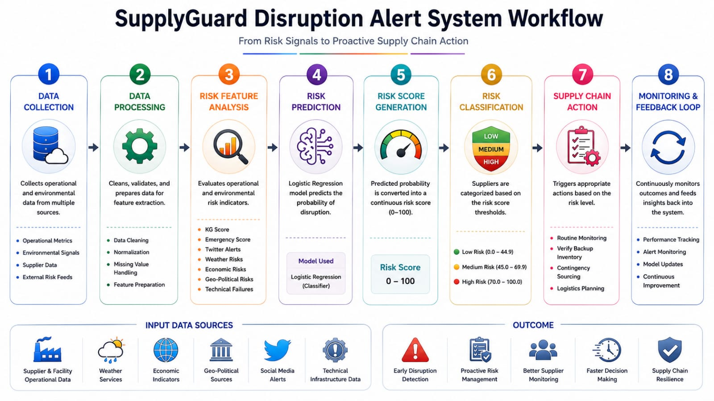

# SupplyGuard Supply Chain Disruption Alert System

## Overview

**SupplyGuard** is an end-to-end predictive risk-monitoring system designed to help supply chain managers identify potential supplier disruptions before they impact production.

The system evaluates operational health metrics and environmental risk signals to generate a continuous **0–100 disruption risk score**, allowing procurement teams to move from reactive disruption management toward proactive risk monitoring.
--
## Live demo
https://supply-chain-disruption-alerts-bsa4jwwtj-muqarrahs-projects.vercel.app/
--
## Dashboard

## Aim

- Predict potential supply chain and supplier disruptions
- Generate a continuous disruption risk score from 0 to 100
- Identify operational and environmental factors contributing to disruption risk
- Provide early warnings before production lines are affected
- Support proactive procurement and contingency planning
- Help supply chain teams prioritize high-risk suppliers

---

## Key Features

- **Predictive Risk Scoring** — Generates a continuous supplier disruption risk score from 0–100
- **Operational Risk Analysis** — Evaluates KG Score and Emergency Score to identify internal operational stress
- **Environmental Risk Monitoring** — Considers weather, economic, geopolitical, technical, and social-alert signals
- **Disruption Prediction** — Uses Logistic Regression to calculate disruption probability
- **Risk Classification** — Categorizes suppliers into Low, Medium, and High Risk
- **Early Warning System** — Identifies potential supplier failures before major operational impact
- **Contingency Support** — Provides risk-based signals for alternate sourcing and logistics planning

## Risk Checker

## Benefits

- **Early Disruption Detection** — Identifies potential supplier problems before production is affected
- **Proactive Risk Management** — Helps teams act before disruptions become critical
- **Better Supplier Monitoring** — Provides a continuous view of supplier risk
- **Faster Decision Making** — Converts multiple risk signals into a simple risk score
- **Reduced Operational Impact** — Supports early contingency and alternative sourcing decisions
- **Improved Supply Chain Resilience** — Helps organizations prepare for potential disruptions

---

## Workflow

The system follows this overall process:

**Operational & Environmental Data → Data Processing → Risk Feature Analysis → Logistic Regression Model → Disruption Probability → Risk Score → Risk Classification → Supply Chain Action**

### Workflow Steps

**1. Data Collection**  
The system receives operational and environmental risk indicators related to suppliers and facilities.

**2. Data Processing**  
The input data is prepared and converted into the features required by the predictive model.

**3. Risk Feature Analysis**  
The system evaluates operational metrics including **KG Score** and **Emergency Score**, along with categorical risk signals such as:

- Twitter Alerts
- Weather Risks
- Economic Risks
- Geo-Political Risks
- Technical Infrastructure Failures

**4. Risk Prediction**  
A **Logistic Regression** classifier calculates the probability of a potential supply chain disruption using the available risk indicators.

**5. Risk Score Generation**  
The predicted probability is converted into a continuous **0–100 risk score**.

**6. Risk Classification**  
The supplier is categorized into Low, Medium, or High Risk based on the operational thresholds.

**7. Supply Chain Action**  
The resulting risk level helps supply chain managers determine the appropriate response, such as routine monitoring, backup inventory verification, or contingency sourcing.

---

## Use Cases

- Supplier risk monitoring
- Supply chain disruption prediction
- Procurement risk management
- Early warning systems
- Contingency sourcing
- Logistics risk monitoring
- Supplier prioritization
- Supply chain resilience planning

## Supplier Risk Monitoring

## Project Goal

The goal of **SupplyGuard** is to transform operational and environmental risk signals into an understandable predictive score that enables supply chain teams to identify potential disruptions early and take proactive action.

> **Risk Signals → Predict Disruption → Generate Risk Score → Classify Risk → Take Proactive Action**

